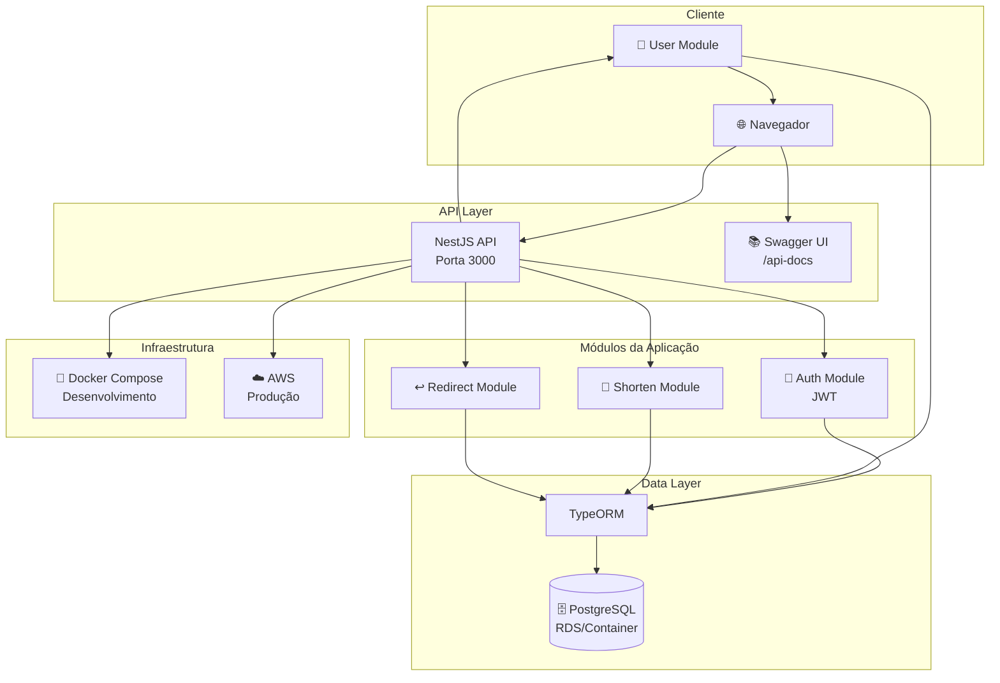
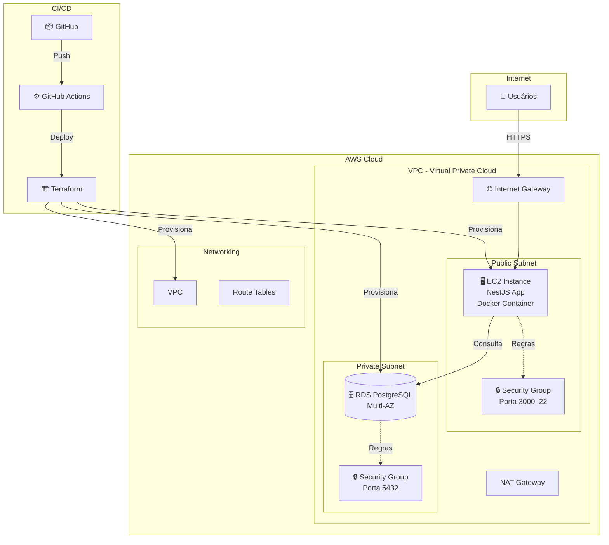
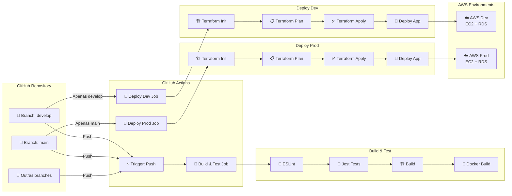
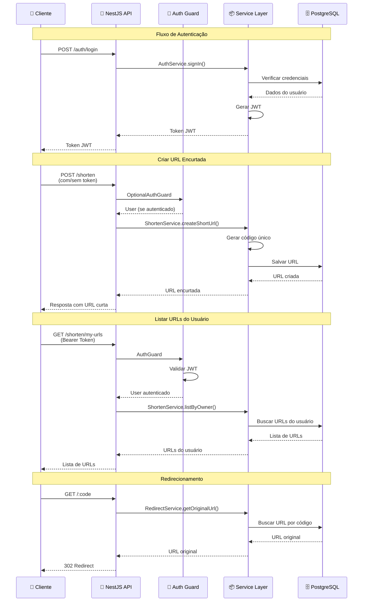
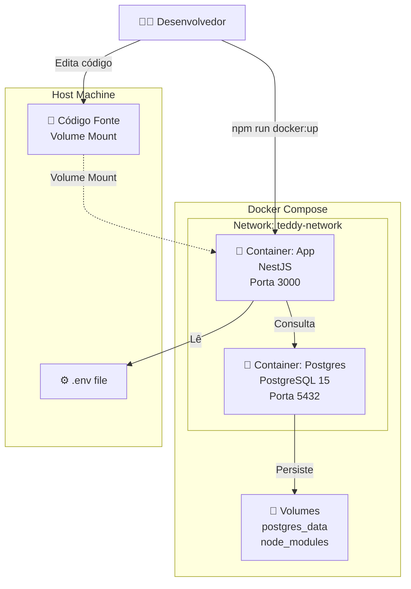

# 🐻 Teddy Backend API

API REST para encurtamento de URLs desenvolvida com NestJS, permitindo que usuários criem links curtos e personalizados, gerenciem suas URLs e façam redirecionamentos.

## 📋 Índice

- [Sobre o Projeto](#sobre-o-projeto)
- [Diagramas de Arquitetura](#diagramas-de-arquitetura)
- [Funcionalidades](#funcionalidades)
- [Tecnologias](#tecnologias)
- [Pré-requisitos](#pré-requisitos)
- [Instalação](#instalação)
- [Configuração](#configuração)
- [Executando o Projeto](#executando-o-projeto)
- [Documentação da API](#documentação-da-api)
- [Comandos Disponíveis](#comandos-disponíveis)
- [Testes](#testes)
- [CI/CD](#cicd)
- [Deploy](#deploy)
- [Estrutura do Projeto](#estrutura-do-projeto)
- [Escalabilidade](#escalabilidade)

## 🎯 Sobre o Projeto

Teddy Backend API é uma solução completa para encurtamento de URLs que permite:

- Criar URLs encurtadas com códigos únicos
- Gerenciar URLs (criar, listar, atualizar, deletar)
- Autenticação JWT para usuários
- Redirecionamento automático para URLs originais
- Suporte a URLs públicas e privadas (associadas a usuários)

## 🏗 Diagramas de Arquitetura

### Arquitetura Geral do Sistema



### Arquitetura de Infraestrutura AWS (Produção)



### Fluxo CI/CD Pipeline



### Fluxo de Requisições da API



### Arquitetura de Desenvolvimento Local



## ✨ Funcionalidades

### Autenticação
- ✅ Cadastro de usuários
- ✅ Login com JWT
- ✅ Proteção de rotas com guards

### Encurtamento de URLs
- ✅ Criar URLs encurtadas (com ou sem autenticação)
- ✅ Listar URLs do usuário autenticado
- ✅ Atualizar URLs existentes
- ✅ Deletar URLs (soft delete)
- ✅ Redirecionamento automático

### Infraestrutura
- ✅ Deploy automatizado com CI/CD
- ✅ Infraestrutura como código (Terraform)
- ✅ Ambientes separados (dev/prod)
- ✅ Containerização com Docker

## 🛠 Tecnologias

### Backend
- **NestJS** - Framework Node.js
- **TypeScript** - Linguagem de programação
- **TypeORM** - ORM para PostgreSQL
- **PostgreSQL** - Banco de dados
- **JWT** - Autenticação
- **Swagger** - Documentação da API
- **Jest** - Testes unitários

### DevOps
- **Docker** & **Docker Compose** - Containerização
- **Terraform** - Infraestrutura como código
- **AWS** - Cloud provider (EC2, RDS)
- **GitHub Actions** - CI/CD

## 📦 Pré-requisitos

Antes de começar, você precisa ter instalado:

- **Node.js** (v20 ou superior)
- **npm** ou **yarn**
- **Docker** e **Docker Compose**
- **Terraform** (v1.6.0 ou superior)
- **AWS CLI** configurado
- **Git**

## 🚀 Instalação

1. Clone o repositório:
```bash
git clone <repository-url>
cd teddy-backend-api
```

2. Instale as dependências:
```bash
npm install
```

3. Configure as variáveis de ambiente (veja [Configuração](#configuração))

## ⚙️ Configuração

### Variáveis de Ambiente

Crie um arquivo `.env` na raiz do projeto com as seguintes variáveis:

```env
# Database
DATABASE_HOST=localhost
DATABASE_PORT=5432
DATABASE_USER=postgres
DATABASE_PASSWORD=postgres
DATABASE_NAME=teddydb

# JWT
JWT_SECRET=your-secret-key
JWT_EXPIRES_IN=1d

# Application
NODE_ENV=development
PORT=3000
```

### Terraform

Configure os arquivos `terraform.tfvars` em cada ambiente:

**`terraform/environments/dev/terraform.tfvars`**
```hcl
aws_region   = "us-east-1"
project_name = "teddy-backend-api"
environment  = "dev"
db_username  = "postgres"
db_password  = "your-password"
my_ip        = "your-ip-address"
```

**`terraform/environments/prod/terraform.tfvars`**
```hcl
aws_region   = "us-east-1"
project_name = "teddy-backend-api"
environment  = "prod"
db_username  = "postgres"
db_password  = "your-password"
my_ip        = "your-ip-address"
```

## 🏃 Executando o Projeto

### Desenvolvimento Local

#### Opção 1: Com Docker Compose (Recomendado)
```bash
# Sobe os containers (app + PostgreSQL)
npm run docker:up

# A aplicação estará disponível em http://localhost:3000
# PostgreSQL em localhost:5432
```

#### Opção 2: Sem Docker
```bash
# Certifique-se de ter PostgreSQL rodando localmente

# Inicia em modo desenvolvimento (watch mode)
npm run start:dev

# Ou em modo debug
npm run start:debug
```

### Produção

```bash
# Build do projeto
npm run build

# Inicia em modo produção
npm run start:prod
```

## 📚 Documentação da API

A documentação interativa da API está disponível via Swagger:

- **URL**: `http://localhost:3000/api-docs`
- **Autenticação**: Use o endpoint `/auth/login` para obter o token JWT e clique em "Authorize" no Swagger

### Endpoints Principais

#### Autenticação
- `POST /auth/login` - Login do usuário
- `POST /users` - Criar novo usuário

#### Encurtamento
- `POST /shorten` - Criar URL encurtada (público ou autenticado)
- `GET /shorten/my-urls` - Listar URLs do usuário (requer autenticação)
- `PUT /shorten/my-urls/:id` - Atualizar URL (requer autenticação)
- `DELETE /shorten/my-urls/:id` - Deletar URL (requer autenticação)

#### Redirecionamento
- `GET /:code` - Redireciona para a URL original

## 📝 Comandos Disponíveis

### Desenvolvimento
| Comando | Descrição |
|---------|-----------|
| `npm run start` | Inicia a aplicação NestJS |
| `npm run start:dev` | Inicia em modo desenvolvimento (watch) |
| `npm run start:debug` | Inicia em modo debug |
| `npm run start:prod` | Inicia em modo produção |

### Build
| Comando | Descrição |
|---------|-----------|
| `npm run build` | Compila o projeto TypeScript |

### Qualidade de Código
| Comando | Descrição |
|---------|-----------|
| `npm run lint` | Executa ESLint e corrige problemas |
| `npm run format` | Formata o código com Prettier |

### Testes
| Comando | Descrição |
|---------|-----------|
| `npm run test` | Executa todos os testes |
| `npm run test:watch` | Executa testes em modo watch |
| `npm run test:cov` | Executa testes com cobertura de código |
| `npm run test:debug` | Executa testes em modo debug |

### Docker
| Comando | Descrição |
|---------|-----------|
| `npm run docker:up` | Sobe os containers (app + PostgreSQL) |
| `npm run docker:down` | Para e remove os containers |
| `npm run docker:build` | Constrói as imagens Docker |

### Terraform - Desenvolvimento
| Comando | Descrição |
|---------|-----------|
| `npm run terraform:init:dev` | Inicializa Terraform para dev |
| `npm run terraform:plan:dev` | Mostra o plano de execução para dev |
| `npm run terraform:apply:dev` | Aplica a infraestrutura em dev |
| `npm run terraform:destroy:dev` | Destrói a infraestrutura em dev |
| `npm run terraform:output:dev` | Mostra os outputs do Terraform em dev |

### Terraform - Produção
| Comando | Descrição |
|---------|-----------|
| `npm run terraform:init:prod` | Inicializa Terraform para prod |
| `npm run terraform:plan:prod` | Mostra o plano de execução para prod |
| `npm run terraform:apply:prod` | Aplica a infraestrutura em prod |
| `npm run terraform:destroy:prod` | Destrói a infraestrutura em prod |
| `npm run terraform:output:prod` | Mostra os outputs do Terraform em prod |

### Deploy
| Comando | Descrição |
|---------|-----------|
| `npm run deploy` | Build + aplica Terraform em dev |
| `npm run deploy:prod` | Build + aplica Terraform em prod |

## 🧪 Testes

O projeto utiliza Jest para testes unitários e de integração.

```bash
# Executar todos os testes
npm run test

# Executar com cobertura
npm run test:cov

# Executar em modo watch
npm run test:watch
```

Os relatórios de cobertura são gerados na pasta `coverage/`.

## 🔄 CI/CD

O projeto utiliza GitHub Actions para automação de CI/CD.

### Workflow

- **Push em qualquer branch**: Executa `build-and-test` (lint, testes, build)
- **Push na branch `develop`**: Executa `build-and-test` + deploy para ambiente **dev**
- **Push na branch `main`**: Executa `build-and-test` + deploy para ambiente **prod**

### Jobs

1. **build-and-test**: Compila, executa lint, testes e build
2. **deploy-dev**: Deploy para ambiente de desenvolvimento (apenas na branch `develop`)
3. **deploy-prod**: Deploy para ambiente de produção (apenas na branch `main`)

## 🚢 Deploy

### Passo a Passo

1. **Configure as credenciais AWS**:
   - Configure o AWS CLI
   - Configure os secrets no GitHub (para CI/CD):
     - `AWS_ACCESS_KEY_ID`
     - `AWS_SECRET_ACCESS_KEY`
     - `AWS_REGION`
     - `PROJECT_NAME`
     - `DB_USERNAME`
     - `DB_PASSWORD`

2. **Configure os arquivos Terraform**:
   - Edite `terraform/environments/dev/terraform.tfvars`
   - Edite `terraform/environments/prod/terraform.tfvars`

3. **Deploy Manual**:
```bash
# Desenvolvimento
npm run terraform:init:dev
npm run terraform:plan:dev
npm run terraform:apply:dev

# Produção
npm run terraform:init:prod
npm run terraform:plan:prod
npm run terraform:apply:prod
```

4. **Deploy Automático via CI/CD**:
   - Faça push para `develop` → deploy automático em dev
   - Faça push para `main` → deploy automático em prod

### Infraestrutura

A infraestrutura na AWS inclui:
- **EC2**: Instância para hospedar a aplicação
- **RDS PostgreSQL**: Banco de dados gerenciado
- **Security Groups**: Configuração de segurança
- **VPC**: Rede virtual isolada

## 📁 Estrutura do Projeto

```
teddy-backend-api/
├── src/
│   ├── auth/              # Módulo de autenticação
│   │   ├── guards/        # Guards de autenticação
│   │   └── dto/           # Data Transfer Objects
│   ├── user/              # Módulo de usuários
│   │   ├── entities/      # Entidades TypeORM
│   │   └── dto/           # DTOs
│   ├── shorten/           # Módulo de encurtamento
│   │   ├── entities/      # Entidades
│   │   └── dto/           # DTOs
│   ├── redirect/          # Módulo de redirecionamento
│   ├── database/          # Configuração do banco
│   ├── shared/            # Código compartilhado
│   ├── app.module.ts      # Módulo principal
│   └── main.ts            # Entry point
├── terraform/
│   └── environments/
│       ├── dev/           # Configuração Terraform dev
│       └── prod/          # Configuração Terraform prod
├── .github/
│   └── workflows/
│       └── ci-cd.yml      # Pipeline CI/CD
├── docker-compose.yml     # Configuração Docker Compose
├── Dockerfile             # Dockerfile produção
├── Dockerfile.dev         # Dockerfile desenvolvimento
├── package.json
└── README.md
```

## 📈 Escalabilidade

### Escala Vertical
- Aumentar recursos da instância EC2 (CPU, RAM)
- Aumentar recursos do RDS (CPU, memória, armazenamento)
- ⚠️ Pode causar downtime temporário durante upgrades

### Escala Horizontal
- **EC2**: Usar Auto Scaling Groups para criar/remover instâncias automaticamente
- **RDS**: Criar réplicas de leitura para distribuir carga de leitura
- **Load Balancer**: Usar ELB/ALB para distribuir requisições entre instâncias

### Desafios e Soluções
- **Sincronização de dados**: Réplicas RDS são somente leitura; escritas vão para instância principal
- **Gerenciamento de estado**: Usar balanceadores de carga (ELB/ALB) para múltiplas instâncias
- **Monitoramento**: Configurar CloudWatch para monitorar uso e performance
- **Auto Scaling**: Configurar políticas de auto scaling baseadas em métricas

---
